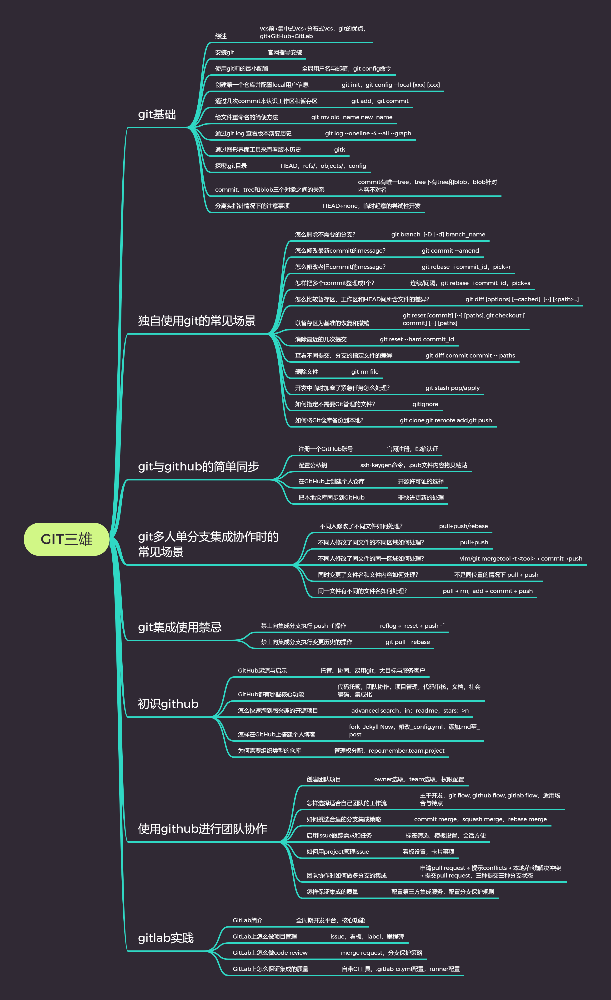

本仓库为个人git、GitHub和GitLab学习过程中的笔记记录，笔记链接和内容框架如下：

* [git 基础](http://note.youdao.com/noteshare?id=59f701aa9fc3817e7615a84a7db18922&sub=2DB078ED5E1A46B797A3FF4550E20E46)
* [独自使用git的常见场景](http://note.youdao.com/noteshare?id=cd58d56a9ce95a646bbfe0aad66e0365&sub=E269E4EF919348BF9602F43CAC3E5113)
* [git和GitHub的简单同步](http://note.youdao.com/noteshare?id=c17a673902a5e3bae5eea67ac4a2bd47&sub=403A34290A25491BB433C647C6CAB36D)
* [git多人单分支集成协作时的常见场景](http://note.youdao.com/noteshare?id=75cf396d8cbe415b66c61b4e23ad30aa&sub=483A97E709D443F380B60F96F8A2D622)
* [git集成使用禁忌](http://note.youdao.com/noteshare?id=de1b80915bc531610df0e5b5aa06b2e0&sub=AC70E191DED146CE957E59C80CB61F8F)

